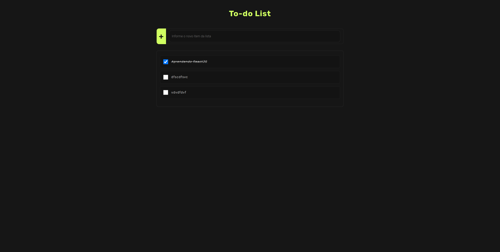

<h1 align="center"> To do list app </h1>

  <a href="#-tecnologias">Tecnologias</a>&nbsp;&nbsp;&nbsp;|&nbsp;&nbsp;&nbsp;
  <a href="#-projeto">Projeto</a>&nbsp;&nbsp;&nbsp;|&nbsp;&nbsp;&nbsp;
  <a href="#-layout">Layout</a>&nbsp;&nbsp;&nbsp;|&nbsp;&nbsp;&nbsp;
  <a href="#memo-licença">Licença</a>

  

 

  

## 🚀 Tecnologias

Esse projeto foi desenvolvido com as seguintes tecnologias:

- Vite
- React
- TypeScript
- Styled-components
- Git
- Github

## 💻 Projeto

Uma lista de tarefas simples

## 🔖 Layout

You can view the project through the links below:

- [Live Preview](https://clock-mat.netlify.app/)

## :memo: Licença

Esse projeto está sob a licença MIT.

---

Projeto proposto pela B7web  
by Matheus Ramalho - [matheusramalho.dev](matheusramalho.dev)
